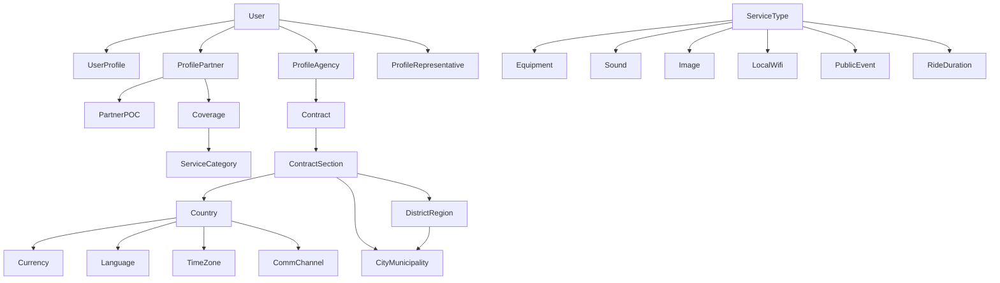

Com base na estrutura do projeto Django fornecido, criei uma **ontologia** que descreve os conceitos principais, entidades, relacionamentos e fluxos de dados. Essa ontologia pode ser usada para documentação, análise de domínio, ou como base para um sistema de conhecimento.

---

## 📦 **Ontologia do Projeto SurogaAPI**

### 1. **Conceitos Fundamentais**

| Conceito               | Descrição                                                                 |
|------------------------|---------------------------------------------------------------------------|
| **SurogaAPI**          | Plataforma de API para "surrogate rides" (passeios substituídos).          |
| **User**               | Usuário do sistema (pode ser admin, parceiro, agência, representante).    |
| **Partner**            | Cliente/parceiro que usa a API para integrar serviços de ride.            |
| **Supplier**           | Fornecedor de serviços (agências, representantes, contratos).             |
| **Ride**               | Passeio/serviço oferecido.                                                |
| **Booking**            | Reserva de um ride.                                                        |
| **Core**               | Módulo central com configurações globais (idiomas, moedas, países, etc.). |
| **API Logger**         | Sistema de log de requisições e respostas da API.                         |
| **Authentication**     | Autenticação via token (TokenAuthentication).                             |

---

### 2. **Entidades Principais (Models)**

#### 2.1 **Core App**
- `time_zone` → Fusos horários.
- `Language` → Idiomas suportados.
- `Currency` → Moedas.
- `country` → Países com detalhes (VAT, código telefônico, etc.).
- `districtregion` → Regiões/distritos.
- `citymunicipality` → Cidades/municípios.
- `usertype` → Tipos de usuário.
- `userprofile` → Perfil estendido do usuário.
- `userloginlog` → Log de logins.
- `events` → Log de eventos/requisições da API.
- `RideDuration` → Durações pré-definidas de rides.
- `equipment` → Equipamentos disponíveis.
- `publicevent` → Tipos de eventos públicos.
- `sound` → Requisitos de som.
- `image` → Requisitos de imagem.
- `localwifi` → Tipos de Wi-Fi local.
- `version` → Controle de versão de endpoints.
- `commchannel` → Canais de comunicação por país.

#### 2.2 **Supplier App**
- `profileagency` → Perfil de agência fornecedora.
- `profilerepresentative` → Representante da agência.
- `contract` → Contrato com fornecedor.
- `contractsection` → Seções do contrato (cobertura geográfica).
- `servicetype` → Tipos de serviço oferecidos.
- `protocol` → Protocolo de comunicação da agência (API, etc.).

#### 2.3 **Partner App**
- `profilepartner` → Perfil do parceiro (cliente da API).
- `partnerpoc` → Ponto de contato do parceiro.
- `coverage` → Cobertura geográfica do parceiro.
- `jobpoc` → Categoria do ponto de contato.

#### 2.4 **Rides App** (não detalhado no merge, mas referenciado)
- `Ride` → Passeio.
- `Booking` → Reserva.
- `paymentlog` → Log de pagamentos.

#### 2.5 **DRF API Logger**
- `APILogsModel` → Log estruturado de requisições/respostas da API.

---

### 3. **Relacionamentos Principais**



---

### 4. **Fluxos de Dados e Regras de Negócio**

#### 4.1 **Autenticação e Autorização**
- Usuários se autenticam via `TokenAuthentication`.
- Decorator `@api_client_required` verifica se o usuário está ativo.
- Logs de login são registrados em `userloginlog` com geolocalização.

#### 4.2 **Gestão de Parceiros (Partner)**
- Parceiros podem:
  - Cadastrar pontos de contato (`partnerpoc`).
  - Definir áreas de cobertura (`coverage`).
  - Visualizar logs de transações, requisições e acessos.
- Perfil do parceiro inclui validações (email, telefone, IBAN, etc.).

#### 4.3 **Gestão de Fornecedores (Supplier)**
- Fornecedores possuem contratos com seções que definem:
  - Regiões de atuação.
  - Tipos de serviço.
  - Canais de comunicação.
- Contratos podem estar ativos/inativos.

#### 4.4 **Logging e Monitoramento**
- Todas as requisições à API são logadas via `drf_api_logger`.
- Logs incluem: usuário, endpoint, método, status, tempo de execução, IP.
- Dados sensíveis (senhas, tokens) são mascarados.

#### 4.5 **Internacionalização (i18n)**
- Suporte a múltiplos idiomas (`Language`).
- Configuração de fuso horário por país.
- Moedas e símbolos configuráveis.

---

### 5. **Configurações Técnicas Relevantes**

#### 5.1 **Banco de Dados**
- Suporte a SQLite (dev) e SQL Server/Azure (prod).
- Migrações organizadas por app.

#### 5.2 **API REST (DRF)**
- Serializers para cada modelo.
- Viewsets para CRUD.
- Permissões: `DjangoModelPermissionsOrAnonReadOnly`.
- Schemas OpenAPI gerados automaticamente.

#### 5.3 **Segurança**
- `SECRET_KEY` via environment variable.
- `DEBUG=False` em produção.
- `ALLOWED_HOSTS` configurado.
- Middlewares de segurança (CSRF, Clickjacking, etc.).

#### 5.4 **Email**
- Configuração SMTP via `decouple`.
- Envio assíncrono com `EmailThread`.

---

### 6. **Glossário de Termos**

| Termo                | Significado                                                               |
|----------------------|---------------------------------------------------------------------------|
| **Surrogate Ride**   | Passeio realizado por um substituto (virtual/terceiro).                   |
| **POC**              | Point of Contact (ponto de contato).                                      |
| **Coverage**         | Área geográfica coberta por um serviço.                                   |
| **ServiceType**      | Categoria de serviço (ex: evento público, equipamento específico).        |
| **ContractSection**  | Cláusula/seção de um contrato com regras específicas.                     |
| **API Logger**       | Sistema que registra todas as chamadas à API para auditoria/debug.        |
| **Geolocation**      | Obtenção de localização via IP (usada em logs de login).                  |

---

### 7. **Diagrama de Contexto (C4 Model - Nível 1)**

```
+------------------+       +-------------------+       +-------------------+
|   Partner App    |       |    SurogaAPI      |       |   Supplier App    |
|  (Frontend/API   |<----->|   (Backend Core)  |<----->|  (Agency/Contract |
|   Consumer)      |       |                   |       |   Management)     |
+------------------+       +-------------------+       +-------------------+
                                  ^
                                  |
                          +-------------------+
                          |   External APIs   |
                          |  (Payment, Email, |
                          |   Geolocation)    |
                          +-------------------+
```

---

Esta ontologia pode ser expandida com:
- Diagramas de sequência para fluxos específicos (ex: booking, login).
- Matriz de permissões por tipo de usuário.
- Modelo de dados completo (ERD).
- Políticas de segurança e conformidade (GDPR, etc.).

Você gostaria que eu detalhasse alguma parte específica ou gere diagramas adicionais?